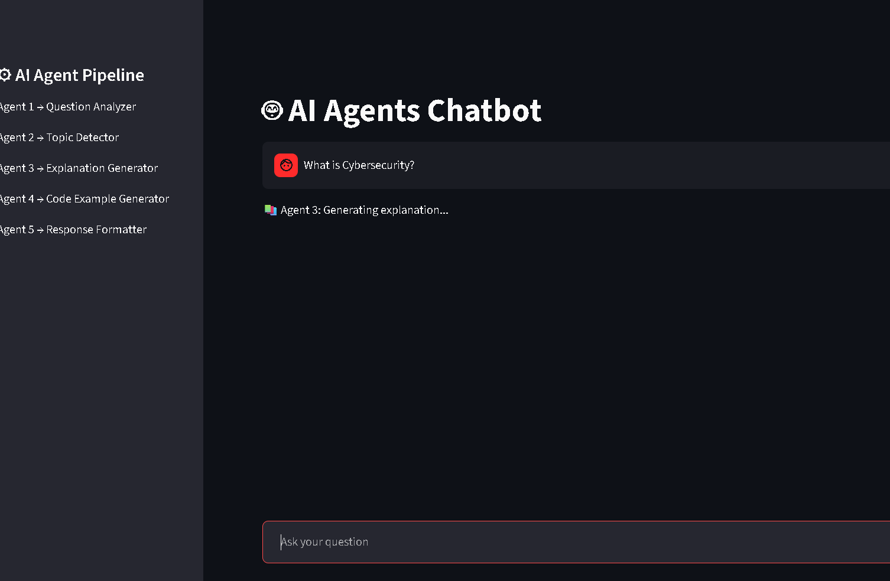
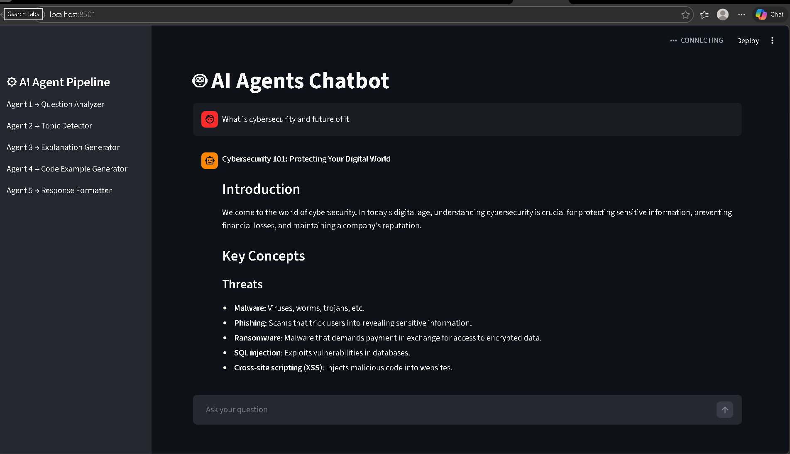

# 🤖 AI Multi-Agent Chatbot

An intelligent **Multi-Agent AI Chatbot** built using **Streamlit and Groq LLM**.
This chatbot uses a pipeline of AI agents to analyze questions, detect topics, generate explanations, produce code examples, and format responses.

The goal of this project is to demonstrate how **AI agents can collaborate to produce structured and informative responses** in a chatbot interface.

---

# 🚀 Features

- Multi-agent architecture
- ChatGPT-style chatbot interface
- Topic detection
- AI explanation generation
- Automatic code example generation
- Response formatting
- Conversation memory
- Clean Streamlit UI

---

# 🧠 Agent Pipeline

The chatbot uses **five AI agents**:

1️⃣ **Question Analyzer**
Understands and rewrites the user's question.

2️⃣ **Topic Detector**
Identifies the main topic of the question.

3️⃣ **Explanation Generator**
Creates a detailed explanation for beginners.

4️⃣ **Code Example Generator**
Produces programming examples related to the topic.

5️⃣ **Response Formatter**
Formats the explanation and code into a structured chatbot response.

---

# 🖥️ Screenshots

## Chatbot Interface



## Agent Pipeline Working



## Example Response


---

# ⚙️ Installation

Clone the repository:

```bash
git clone https://github.com/Kshitija80/ai-agent-chatbot.git
cd ai-agent-chatbot
```

Install dependencies:

```bash
pip install -r requirements.txt
```

Run the application:

```bash
streamlit run app.py
```

---

# 🔑 Environment Variables

Add your **Groq API key** in Streamlit secrets:

```
GROQ_API_KEY="your_api_key"
```

---

# 🛠️ Technologies Used

- Python
- Streamlit
- Groq LLM
- Multi-Agent Architecture

---

# 📌 Future Improvements

- Internet search agent
- Streaming responses (typing effect)
- File upload + AI analysis
- Multiple model selection
- Chat history export

---

# 👩‍💻 Author

**Kshitija More**

IT Engineering Student
Interested in AI, software development, and intelligent systems.

---

# ⭐ If you like this project

Give it a ⭐ on GitHub!
